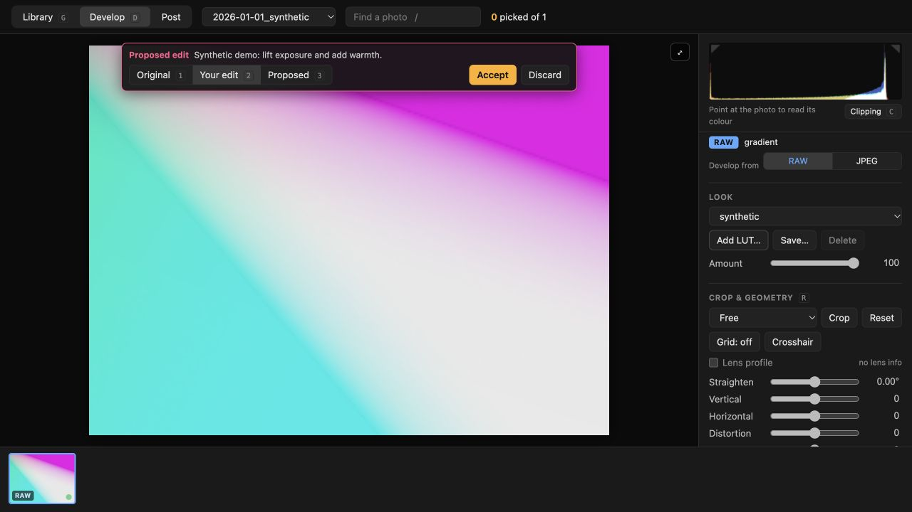

# Framewright

A local photo editor built to work alongside an AI agent. Cull photographs,
develop RAWs, and arrange post layouts in a browser. Edits and proposals are
plain JSON beside the photos, so Claude Code, Codex, or another file-based agent
can render an idea and show it live for you to accept or discard.

The application uses standard-library Python and plain browser modules. There
is no JavaScript build step and no required Python runtime dependency.



The demo uses a generated test image; no personal photographs or third-party LUTs are included.

## Run

Requires **Python 3.10+** and a current browser with WebGL2. From a checkout:

```sh
python -m framewright
```

The app opens at http://localhost:8765. On first run, enter an absolute library
folder path. A new empty folder works. A library contains shoot folders directly:
if migrating from the personal tool, select its existing `shoots/` folder.

```sh
python -m framewright --library /path/to/library
python -m framewright --port 9000 --no-browser
```

To install the checked-out release as a command:

```sh
pipx install .
framewright --library /path/to/library
```

You can also install a downloaded wheel with `pipx install PATH_TO_WHEEL`.
The project has not been published to PyPI. The browser RAW decoder is bundled;
no network access is needed to edit local photographs.

The **Library** tab culls shoots and collections. **Develop** provides exposure,
colour, curves, masks, geometry, looks and JPEG export. **Post** arranges selected
photos into slides. The app reloads code changes and watches recipes/proposals
for live updates; revision checks prevent stale saves from silently overwriting
newer work.

## Settings and storage

Library selection is `--library`, then `$STUDIO_LIBRARY`, then saved config.
There is no Git-checkout fallback. The importer and renderer use the same order;
without a configured library they print a setup error.

The server keeps an in-memory photo index for day counts, search and source
lookups. The first request scans the library; subsequent requests reuse each
day's file list. Directory, offload-manifest and storage-setting changes refresh
affected days on the next lookup. Files modified in place are rechecked within
30 seconds of subsequent use. Picks and recipes remain live reads. The index
is rebuilt after a server restart and does not write into the photo library.

Config lives at `$XDG_CONFIG_HOME/framewright/config.json` (default
`~/.config/framewright/config.json`) on macOS/Linux, or
`%APPDATA%/framewright/config.json` on Windows. `$STUDIO_CONFIG` overrides the
config file location. The `STUDIO_*` environment names remain supported for
compatibility. Example:

```json
{
  "library": "~/Pictures/Framewright",
  "store": null,
  "luts": [],
  "port": 8765,
  "shoot_folder_pattern": "{date}_{camera}",
  "delete_from_card": false
}
```

Paths support `~`; relative config paths resolve beside the config file.
Relative command-line and environment paths resolve from the working directory.
`--port` overrides the saved port. Restart after editing config.

Storage is optional. Set `store` to an existing ordinary folder or a folder on
a mounted drive. `$STUDIO_STORE` overrides it; `$PHOTO_STORE` remains accepted.
Offload appears when the store is available. It copies and verifies each file,
records it in the shoot manifest, then removes the library copy. Aliases of the
source and conflicting destination contents are refused. Unmounted removable
paths under `/Volumes`, `/media` and `/run/media` cannot silently redirect
writes onto the internal disk. Windows drive roots must be available too.

With a store disconnected, manifests keep frames listed and cached previews
available. Editing the original RAW or exporting full resolution requires the
original files. Import defaults to the local library if the store is absent.

Library contents:

```text
<shoot>/picks.txt                    one picked frame key per line
<shoot>/raw/<key>.edit.json         accepted recipe
<shoot>/raw/<key>.proposal.json     suggestion awaiting review
<shoot>/export/<key>.jpg            rendered export
<shoot>/store.json                 offloaded-file manifest
looks.json                         saved looks
collections.json                   ordered sets of frames
luts/<name>.cube|.xmp              optional legacy LUT folder
.review/                           scratch review renders
posts/<collection>/NN.jpg           exported post slides
```

## Import and send

Connect a card with DCIM, or a Sony M4ROOT/CLIP layout, to use **Import**.
Windows detection checks removable drive types. CLI import can also read any
explicit source folder:

```sh
framewright import --source /path/to/card --library /path/to/library --dry-run
framewright import --source /path/to/card --library /path/to/library
```

Shoot names use capture date and an EXIF make/model slug. Customize the pattern
with `{date}` and `{camera}` in config or `--shoot-folder-pattern`; paths and
unsafe folder names are rejected. JPEG/HEIC/HEIF and ARW, CR2, CR3, NEF, DNG,
RAF, RW2, ORF, PEF and SRW are recognized, along with video and attached XMP,
THM and LRV sidecars. Recognition/import does not guarantee every codec variant
can be decoded by the bundled LibRaw or browser.

Copies are SHA256 verified. Partial imports retry missing siblings without
skipping an entire frame. Different bytes at the same destination are refused.
**Delete from card after verified copy** is off by default. If enabled, cleanup
waits until the complete selected batch succeeds, then rechecks each destination
before removing its copied source. Skipped and unrecognized files stay on the
card. `--no-delete-from-card` overrides a saved deletion preference. Eject is
available on macOS; use the operating system's eject control elsewhere.

**Send** exports the selected scope, then either reveals it in the local file
manager or sends it to a Tailscale device. Taildrop targets appear only when
Tailscale reports them; Tailscale is optional. No cloud upload occurs when
choosing File manager.

## Looks and LUTs

Three original numeric looks are built in. They use curves, split toning and
grain; no third-party creative content is included. Your first saved look copies
the built-ins into the library's own `looks.json`, where you can edit/delete them.

Use **Add LUT…** or drop a `.cube` file on the look controls. The browser and
server validate it, and installation copies it into the user LUT folder outside
the app. Existing files with different content are not overwritten.

Camera Raw / Lightroom look profiles (`.xmp` with an RGB table, such as many
film-stock profiles) work the same way. The profile's RGB table is baked into
an sRGB LUT at the profile's own amount; any other settings it carries
(exposure, curves, and so on) are ignored, and 1D tables are not supported.

Search order is `$STUDIO_LUTS` (platform-separated folder list), config `luts`,
the user LUT folder, then `<library>/luts`. The user folder is
`~/Library/Application Support/framewright/luts` on macOS,
`$XDG_CONFIG_HOME/framewright/luts` (default `~/.config/framewright/luts`) on
Linux, and `%APPDATA%/framewright/luts` on Windows.

New LUT looks carry `lutHash`, the first 16 hex digits of SHA256. Resolution
prefers that fingerprint across all search folders, then the filename. Missing
LUTs and filename fallbacks with a different fingerprint are marked in menus,
Develop, and headless output. Missing LUTs render without the LUT; mismatches
render the named file with a warning. Keep these notes when judging a render.
Legacy recipes with only a filename still work. Reload after changing files on
disk; UI-installed LUTs update immediately.

## Editing with an agent

Read [AGENTS.md](AGENTS.md). The agent can inspect an image, try a recipe, and
write a proposal without changing an accepted edit:

```sh
framewright render --library /path/to/library 2026-01-01_camera/FRAME0001 --recipe edit
framewright render --check /path/to/trial.json
framewright render --library /path/to/library 2026-01-01_camera/FRAME0001 --recipe /path/to/trial.json
framewright render --library /path/to/library 2026-01-01_camera/FRAME0001 --propose /path/to/trial.json --note "Warmer white balance and gentler highlights"
```

The first/third commands print a scratch JPEG path for the agent to inspect.
Rendering uses the app's actual WebGL pipeline in Chrome, Chromium, Edge or
Brave. Set `$CHROME` to choose an executable. `--full` uses original resolution;
`--max PX` limits output size, and `-o` chooses the destination. Repeat `--recipe`
for comparisons, or use `--recipe -` for JSON on stdin.

`--check` validates a recipe offline without a library or browser. `--propose`
validates and cleans it through the server's cleaner and writes a proposal next
to the frame. Replacing an existing proposal requires `--replace-proposal`.
Accepted `*.edit.json` files are untouched. The UI lets the person accept,
tweak, or discard the suggestion.

[recipe.schema.json](framewright/recipe.schema.json) is generated from the
cleaner contract. It covers adjustment ranges, curves, crop, looks and masks;
`--check` also performs semantic checks such as unique curve x coordinates.

## Camera support and previews

RAW decoding uses LibRaw. Camera JPEG matching uses numeric profiles: unknown
cameras get the default tone curve and identity matrix. See the
[camera-profile guide](docs/camera-profiles.md) for fitting and contributing a
profile from your own RAW/JPEG pairs.

ImageMagick, or macOS `sips`, provides resized cached previews. Without either,
the server returns the camera JPEG or extracts the largest complete embedded
JPEG from a RAW for the browser to decode. This fallback is not downscaled,
so large libraries may load more slowly. Files with no usable embedded JPEG
need an image tool for thumbnails; supported RAWs can still be developed using
LibRaw. HEIC/HEIF preview support depends on installed tools/browser codecs.

## Development and release checks

```sh
python -m unittest discover -s tests -v
node --test tests/*.test.mjs
python tools/check_release.py --all
python -m framewright schema --out framewright/recipe.schema.json
```

Node 22 is only used for tests. CI runs Python 3.10 and 3.12 on macOS, Linux
and Windows, builds/inspects distribution files, and checks a wheel installation
outside the checkout. An opt-in full RAW smoke test generates a synthetic DNG:
set `STUDIO_RAW_SMOKE=1` when running the tests with a supported browser installed.
No test fixtures require personal photographs or licensed LUTs.

See [CONTRIBUTING.md](CONTRIBUTING.md), [SECURITY.md](SECURITY.md), and
[THIRD_PARTY.md](THIRD_PARTY.md). Framewright code is MIT licensed; the bundled
RAW decoder keeps its own notices and replaceable files.
